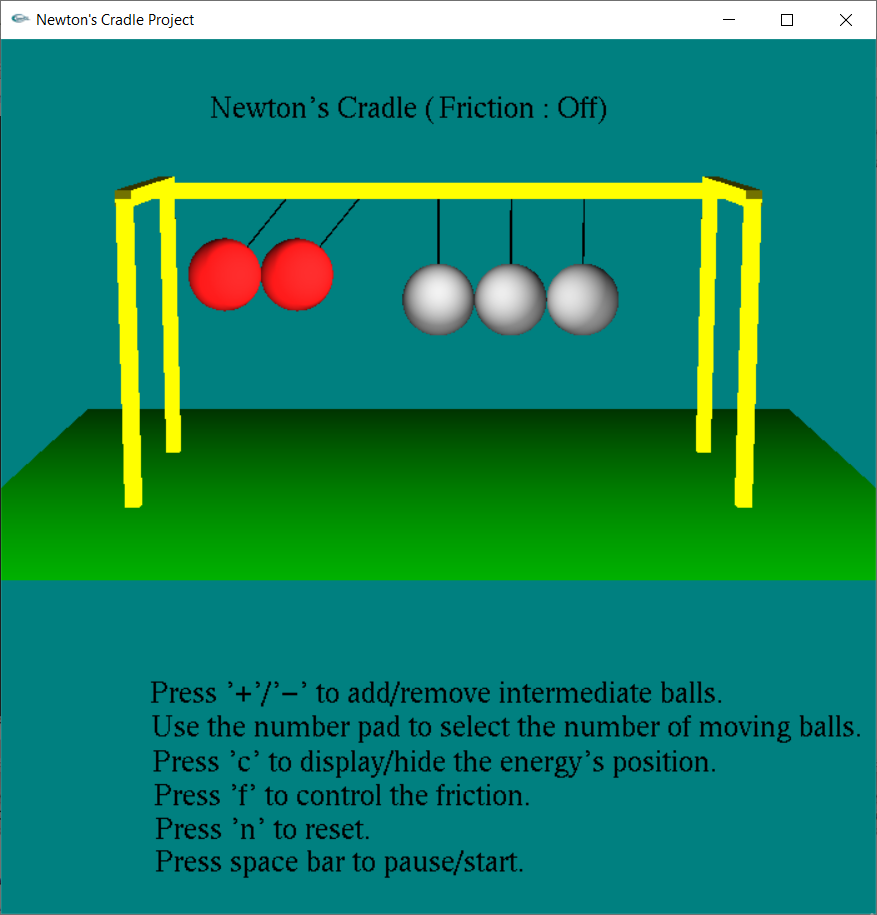

# newton-s-cradle
 An interactive animation made using the freeglut library that illustrates the workings of a Newton's Cradle and the physical phenomenons behind it (conservation of energy, transfer of energy, loss of energy).
 
